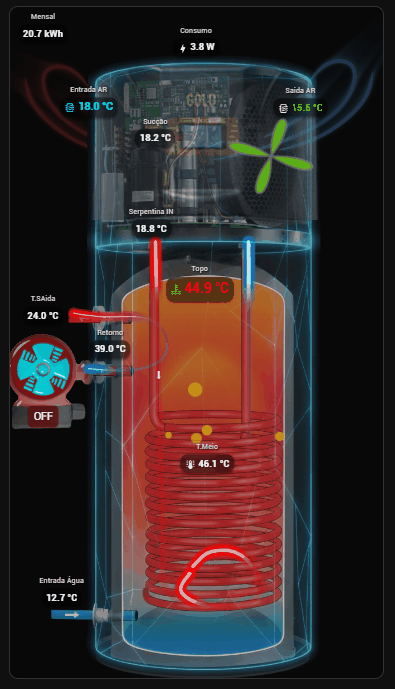

<div align="right">
  <a href="README.pt.md">pt Português</a> | <b>en English</b>
</div>

# Heat Pump Card

[](https://my.home-assistant.io/redirect/hacs_repository/?owner=sfelectronica&repository=bomba-calor-card&category=plugin)

A custom card for Home Assistant focused on visualizing Heat Pump systems, with animations for flow, fans, and piping.

<!-- Replace 'preview.gif' with your gif file name after uploading to GitHub -->


## Installation via HACS

Click the "Open in HACS" button above or follow the manual steps:

1.  Make sure you have [HACS](https://hacs.xyz/) installed.
2.  Go to **HACS** > **Frontend**.
3.  Click the 3-dot menu in the top right corner -> **Custom repositories**.
4.  Add this GitHub repository URL: `https://github.com/sfelectronica/bomba-calor-card`
5.  Category: **Lovelace**.
6.  Click **Add** and then install the card.

## Manual Installation

1.  Download the `bomba-calor-card.js` file from this repository.
2.  Copy the file to the `/config/www/community/bomba-calor-card/` folder in your Home Assistant (create the folder if it doesn't exist).
3.  Add the resource to your Dashboard.

If using YAML mode (`configuration.yaml`), add the following:

```yaml
lovelace:
  resources:
    - url: /local/community/bomba-calor-card/bomba-calor-card.js
      type: module
```

## Background Image

By default, the card looks for an image at `/local/cardbomba.jpg`.
You should upload your background image to the `www` folder of your Home Assistant and configure the path in the card's visual editor.

### Downloading Images
You can download the example images directly from the repository:
- Main Background Image (BombaGold.png)
- Pump Image (pumpgold.png)

## Features

This card offers a robust set of tools to create animated hydraulic and thermal schematics:

### 1. Integrated Visual Editor
*   **"Point-and-Click" Configuration:** Click directly on the preview image to position sensors, pumps, and fans.
*   **Pipe Drawing Tool:** Draw complex curved paths (Bézier Curves) by clicking on the image, with curve tension adjustment.
*   **Drag-and-Drop:** Reorder entities in the list by dragging them.
*   **Guide Grid:** Auxiliary grid for precise alignment of elements.
*   **Backup and Restore:** Export and import the complete card configuration in JSON format.
*   **Multi-language:** Interface available in Portuguese, English, Spanish, French, and German.

### 2. Entity Management
*   Support for multiple sensors (temperatures, pressures, consumption).
*   Full customization: Name, Icon, Text Color, Icon Color, and Background Color (Badge).
*   Individual font size adjustment.
*   Option to hide labels or icons.
*   **Main Switch:** Dedicated button to turn the recirculation pump on/off with a visual status indicator.
*   **Dynamic Colors:** Change the icon color automatically based on threshold values (e.g., Blue if < 10°, Red if > 60°).
*   **Font Weight:** Option to choose between Normal or Bold font weight.

### 3. Flow Animations (Piping)
Create visual representations of fluid passing through pipes:
*   **Line Styles:** Dashed, Dots, **Shimmer**, **Pulse**, and **Comet**.
*   **Gradients:** Define start and end colors to simulate heating or cooling along the pipe.
*   **Activation Logic:** Animations can be activated by the entity's state (e.g., "on") or by a **Numeric Threshold** (e.g., activate only if power > 20W).
*   Control over speed, width, and trail size.
*   **Low Performance Mode:** Option to disable heavy effects (blur) for smoother performance on older devices.

### 4. Dynamic Components
*   **Fans:**
    *   3D simulation with Tilt and Skew adjustment.
    *   Animated rotation with adjustable speed.
    *   Reverse rotation option.
*   **Circulator Pumps:**
    *   Rotating rotor animation.
    *   Support for **Custom Images** (upload your own pump image that will spin).
*   **Water Tanks:**
    *   Visualization of reservoirs with bubble, wave, ripple, or **Fire** effects.
    *   **Fire Effect:** Use an animated GIF (supports transparency) that dynamically changes color based on temperature. Useful for representing a pellet boiler.
    *   Configurable colors and opacity.

## License

This project is licensed under the MIT License - see the LICENSE file for details.
Basically: you can freely use, modify, and distribute it, but without warranties of functionality or liability from the author.